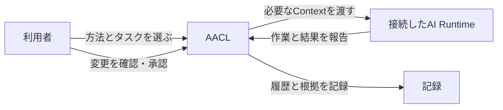
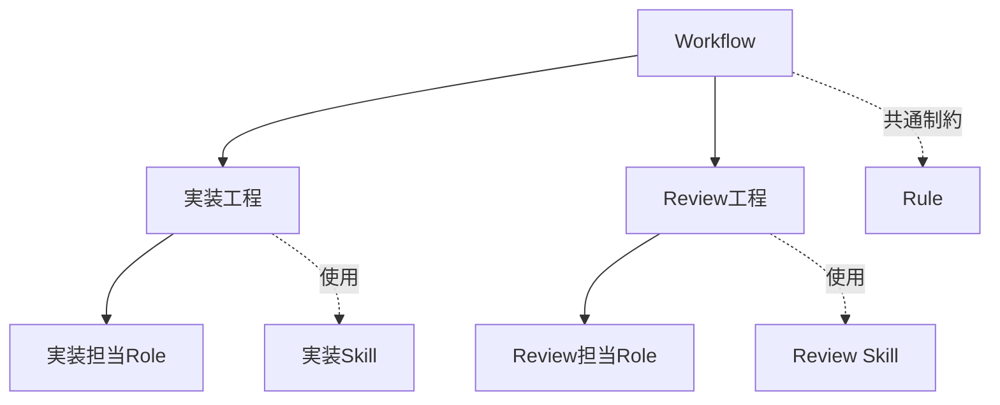
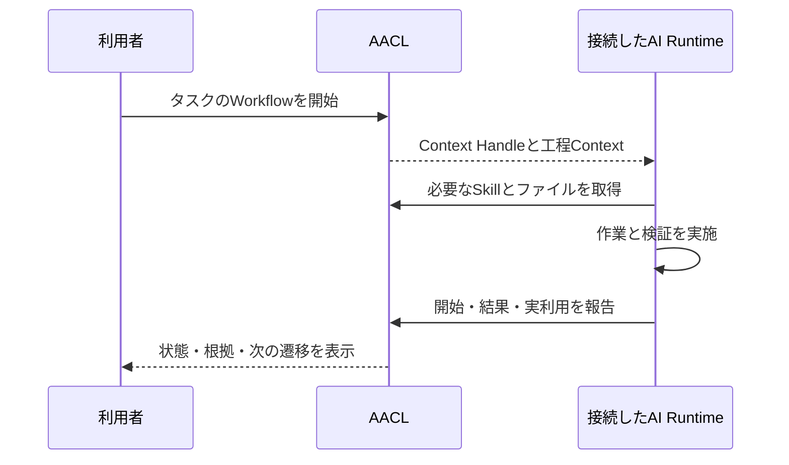
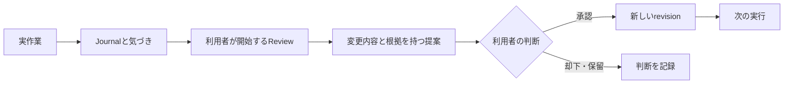

# Agent Asset Control Layer (AACL)

[English](README.md) | [日本語](README.ja.md)

AACLは、AI開発の知見を再利用・確認できる方法へ整理するローカルのコントロール層です。指示をAssetとして管理し、Claude CodeやCodexなどの接続AIクライアントから実行し、作業記録をもとに方法を改善します。

AACLの役割は、方法の管理と実際の作業を分けることです。

## AACLで実現すること

- 開発方法を、分散したプロンプトファイルではなく再利用可能なAssetとして保存する。
- 作業を、工程・責務・成果物・差し戻し経路を持つWorkflowとして表現する。
- 必要な場所でRole、Skill、Rule、Task Type、Capabilityを再利用する。
- 具体的なタスクに対してWorkflowを開始し、接続したRuntimeに実作業を任せる。
- 現在の工程に必要なContextだけを渡し、Skill本文や補助ファイルは必要時に取得する。
- 固定したrevision、提供したContext、実行報告、Skillの実利用を追跡できるようにする。
- 既存の指示を出所・分類・検証・復元手段付きでAACLへ移行する。
- 実作業で得た気づきを記録し、確認可能な改善提案へ変える。
- 承認した変更を新しいrevisionとして適用し、履歴・Snapshot・判断を保持する。
- 一貫したAsset一式を、接続利用用または単独利用用にExportする。

## Assetで開発方法を表現する

Assetは、ID、revision、適用条件、他のAssetとの関係を持つ再利用可能な指示や知識です。

| Asset | 役割 |
| --- | --- |
| Workflow | 工程、責務、遷移、成果物、完了条件を定義する。 |
| Role | 工程の担当と、そこで作る成果物を定義する。 |
| Skill | 必要時に使う手順・知識・補助ファイルを提供する。 |
| Rule | 条件に一致したときに適用する指示を提供する。 |
| Task Type | 作業の目的、品質基準、制約を定義する。 |
| Capability | 外部ツールの接続と利用許可を定義する。 |
| その他 | Project知識、方針、テンプレート、未分類の情報を保持する。 |

委任と工程の制御はWorkflowが持ちます。Skillは現在の担当者が使う方法を提供するもので、担当者や次の工程を決めるものではありません。

## 必要なContextで実行する

Workflowを開始すると、選択したAssetのrevisionと条件をSnapshotへ固定します。接続したRuntimeには、現在の工程、Role、適用するRule、Skill候補を渡します。必要なSkill本文や補助ファイルは、固定したrevisionから必要時に取得します。

Contextを提供した記録と、実際に利用したという報告は分けて保存します。確認のためにSkillを取得しただけでは、利用したことにはしません。RunはContext Handleで識別し、後続の取得・報告・遷移を正しい実行へ結び付けます。

AACLは方法、Context、状態、記録を管理します。Modelの呼び出し、ツール操作、開発作業はRuntimeが行います。Runの開始は実行を準備する操作であり、AIや結果を暗黙に作り出す操作ではありません。

## 実作業から方法を改善する

Journalには、実際のタスクで役立ったこと、困ったこと、改善の種を記録します。利用者が明示的にレビューを開始すると、関連するRunのSnapshot、履歴、Provenanceを結び付け、具体的な提案を作ります。

提案を承認・保留・却下するのは利用者です。過去のSnapshot、実行記録、Provenance、判断は比較できる状態で残します。過去の状態へ戻す場合も、履歴を書き換えず新しいrevisionを作ります。

## 既存の指示を移行して再利用する

AACLでは、既存の指示を出所を失わず、元ファイルを壊さずに構造化された方法へ移行できるようにします。移行では次のことを行います。

- 候補となる指示と補助ファイルを発見する。
- 実際の責務に基づき、Workflow、Role、Skill、Ruleなどへ分類する。
- 元のパス、ハッシュ、Provenanceを保持する。
- 読み書きと分類を検証してから利用を切り替える。
- 未対応形式やPlugin管理の資産は、理由を残して元の場所に置く。
- 後から変更された元ファイルを上書きせず、以前の構成を復元できるようにする。

同じAsset一式を、AACLへ接続して使うPackage、またはCoreなしで使うStandalone PackageとしてExportできます。

## インターフェース

ブラウザーUI、MCP、CLIは同じCore操作を利用します。UIではAsset、Run、Journal、提案、履歴、診断を確認・管理します。MCPでは接続AIクライアントがContext取得、Skill取得、実行報告、変更依頼を行います。CLIはProject単位の操作や保守に使います。

AACLは個人向けのローカル利用を想定しています。正本の記録と変更されない実行根拠をローカルのデータストアに保持します。

## セットアップ

インストール、起動、Runtime接続、ポート、環境設定、移行、Backup、復元、検証は[docs/setup.md](docs/setup.md)を参照してください。
