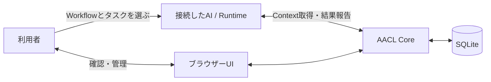
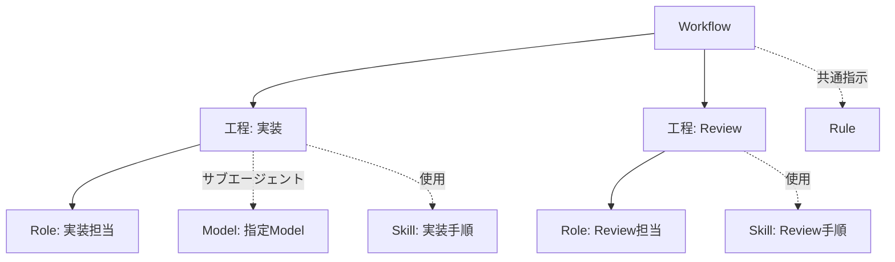
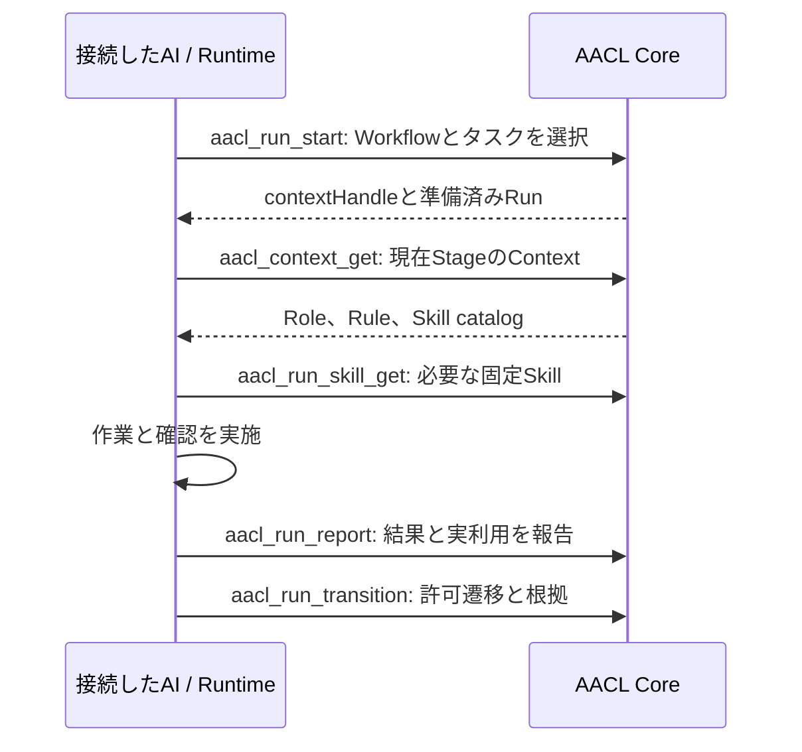
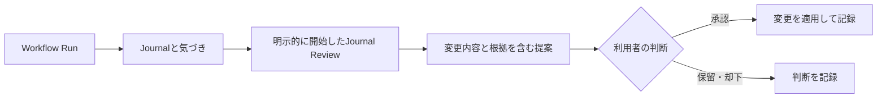

# Agent Asset Control Layer (AACL)

[English](README.md) | [日本語](README.ja.md)

AACLは、AI開発の進め方を再利用可能な資産として整理し、接続したAIクライアントからWorkflowを実行し、作業記録をもとに改善するローカルアプリです。正本の資産と実行状態をSQLiteに保存し、ブラウザーUIとHTTP MCPから同じ操作を提供します。CLIは導入と保守に使います。

利用者がタスクに使うWorkflowを選んで開始します。AACLは担当者への指示を提供し、報告された進行状態を記録します。実際の開発作業やツール操作は、接続先のAI Runtimeが行います。



## インターフェースと対応環境

| インターフェース | できること |
| --- | --- |
| ブラウザーUI | Assetの管理、Workflow Runの開始・確認、Journal・提案・履歴・診断の確認。現在のUI表示は日本語です。 |
| HTTP MCP | `/mcp` endpointから接続AIクライアントがAACLの状態を読み書きします。 |
| CLI | ローカルServiceの導入・起動、Project登録、Runtime接続、保守を行います。 |

個人向けのローカル利用を対象とします。導入後のServiceは`127.0.0.1:4319`、開発・テスト用Serviceは`127.0.0.1:4318`で待ち受けます。対応環境はWSL上のNode.js 24とJavaScriptが有効なChromium系ブラウザーです。

## 導入して起動する

GitHubの公開リポジトリからCLIを一度実行し、ローカルアプリをSetupします。

```bash
npm exec --yes --package=github:Memoria-ll/agent-asset-control-layer-personal -- aacl setup
```

導入用のBuild済みCLIをリポジトリに含めているため、GitHubから実行するときにBuild scriptは不要です。npm 12以降はGit依存を既定で拒否するため、その場合は次のようにこのコマンドでGit導入を許可してください。

```bash
npm exec --yes --allow-git=all --package=github:Memoria-ll/agent-asset-control-layer-personal -- aacl setup
```

`setup`はBuildしたアプリを管理フォルダー（既定は`$XDG_DATA_HOME/aacl`、未設定なら`~/.local/share/aacl`）へコピーします。
同じコマンドをもう一度実行すると、SQLiteのデータと生成済みRuntime入口を保持したままアプリ部分だけ更新します。

4318で導入済みの環境を4319へ移行する場合だけ、先に4318のServiceを停止します。

```bash
npm exec --yes --prefer-online --package=github:Memoria-ll/agent-asset-control-layer-personal -- aacl --port 4318 stop
npm exec --yes --prefer-online --package=github:Memoria-ll/agent-asset-control-layer-personal -- aacl setup
```

既定の管理フォルダーは`$XDG_DATA_HOME/aacl`です。未設定の場合は`~/.local/share/aacl`を使います。その`bin`ディレクトリを`PATH`へ追加し、Serviceを確認します。

```bash
export PATH="$HOME/.local/share/aacl/bin:$PATH"
aacl health
```

[http://127.0.0.1:4319](http://127.0.0.1:4319)を開きます。`aacl connect`はCodexとClaude Code向けのMCP登録コマンドを表示します。利用するクライアント用のコマンドを実行してください。接続先は`http://127.0.0.1:4319/mcp`です。

`setup`は編集可能な`journal`と`journal-review`のSkill Assetも導入します。管理するProjectのルートで`aacl init`を実行すると、Project登録とProject scopeのRuntime設定先を準備します。

WSL上で`setup`を実行すると、Windowsログオン時に対象WSLとAACL Serviceを起動するタスクも登録します。配置するRuntime入口にはAsset IDを渡すMCP operationだけを記載します。自動起動は`aacl autostart enable`、`aacl autostart disable`、`aacl autostart status`で管理します。

主なCLIコマンド:

| コマンド | 役割 |
| --- | --- |
| `aacl ensure` | Serviceが停止中なら起動します。 |
| `aacl autostart <action>` | `enable`、`disable`、`status`でWindowsログオン時のWSL Service自動起動を管理します。 |
| `aacl connect` | Serviceを起動し、MCP clientの登録コマンドを表示します。 |
| `aacl init` | 現在のディレクトリをProjectとして登録します。 |
| `aacl diagnostics` | 参照、Run状態、提供Contextの診断を表示します。 |
| `aacl export DIRECTORY` | 新しいディレクトリへMarkdownと`records.json`を出力します。 |
| `aacl backup FILE` | 新しいファイルへ整合性を保ったSQLite Backupを作成します。 |
| `aacl restore FILE --dir NEW_DIRECTORY` | 対応Backupを新しい管理フォルダーへ復元します。 |

導入、接続、日常利用、復旧の詳しい手順は[導入・利用手順](docs/setup.md)を参照してください。

## Projectを登録して管理範囲を整理する

AACLに認識させるProject rootで`aacl init`を実行します。Project IDとrootはCoreに登録されます。新規登録時にGlobalのBindingをProject scopeへコピーし、そのProjectのClaude CodeとCodexのRuntime設定先を登録します。登録済みrootに対する再実行では既存Projectが返ります。

AssetはGlobalまたは特定Projectの管理先に作成できます。Project Commonには、そのProjectへ適用するRuleを保存します。Runtime設定先はscopeごとに登録するため、Global設定先にはGlobalの入口を、Project設定先にはそのProjectの入口を生成します。

## Assetと関係

Assetは再利用する指示や知識を保持します。各AssetはID、種類、revision、GlobalまたはProjectの管理先を持ちます。BindingでAsset同士やWorkflowの工程を明示的に結びます。

| 種類 | 役割 |
| --- | --- |
| Workflow | 工程、許可する遷移、担当Role、完了条件を定義します。 |
| Role | Workflowの工程で担う責務と期待する成果を定義します。 |
| Skill | 再利用する手順や知識を保持し、補助ファイルを持てます。 |
| Rule | 紐づけたAssetや工程へ適用する指示を保持します。 |
| Model | Model名と呼び出し方を保持し、SkillやRuleを紐づけられます。 |

Workflowの各工程には1つのRoleを割り当て、必要な工程にはModelを指定できます。Modelを指定した工程はそのサブエージェントで実行する指示になり、連続する同じRole・Modelの工程では同じサブエージェントを使います。必要な場所にSkillとRuleを紐づけます。SkillはRuntimeから直接起動する設定もできます。Asset作成後に種類や管理先は変更できません。異なる種類・管理先にする場合は、正しい値でAssetを作成して関係を付け替えます。



## 既存の指示をAACLへ移す

現在のアプリでは、UIまたはMCPからAssetを登録して整理できます。フォルダー全体を取り込む機能はありません。移行時は同名の指示を一律統合せず、実際の責務や手順を比べてWorkflow、Role、Skill、Rule、Modelに分類します。元の方法にある関係だけを再構成し、登録内容とRuntime入口を確認するまで元ファイルを保持します。

分類、登録、Runtime入口、移行後の照合手順は[既存Skill・指示の移行ガイド](docs/skill-migration.md)を参照してください。

## Runtime入口を生成する

Assetの管理先に対応するGlobalまたはProject scopeへ、Claude CodeまたはCodexのRuntime設定先を登録します。Workflowと直接起動が有効なSkillの入口が生成されます。

| Runtime | 生成される入口 |
| --- | --- |
| Claude Code | `<target>/commands/<slug>.md` |
| Codex | `<target>/skills/<slug>/SKILL.md` と `<target>/skills/<slug>/agents/openai.yaml` |

入口はAsset IDを参照し、指示本文はAACLから取得します。本文の正本はSQLiteにあります。Windowsの設定先では生成入口から`wsl.exe`を呼び出します。生成後に管理対象の入口が編集された場合、同期はその内容を上書きせず診断へ記録します。Runtime設定先の管理を解除しても、生成済み入口は残ります。

## ブラウザーUIからWorkflowを開始する

1. Asset LibraryでWorkflowを選び、Runを開始します。
2. タスクの指示とProject・Runtimeなどの条件を入力して開始します。
3. 準備されたRun画面でAIへの依頼をコピーし、接続先AIクライアントへ送ります。
4. Run画面で報告された進行、提供Context、結果、次に許可される遷移を確認します。

Run開始でAACLに準備状態とSnapshotが作られます。AIは自動起動しません。接続先Runtimeが作業を行い、開始と結果をAACLへ報告します。

## MCPからWorkflowを使う

クライアント接続後、AACLのBootstrap案内を読み、登録済みAsset IDを使います。`aacl_usecase_search`でWorkflowと直接起動Skillを検索できます。Workflowは明示的に選んで開始します。

```json
{
  "workflowId": "registered-workflow-id",
  "instruction": "ログイン障害を修正する",
  "runtime": "codex"
}
```

この値を`aacl_run_start`へ渡します。ProjectのAssetを使うRunでは`projectId`も指定します。応答の`contextHandle`を後続のRun操作へ同じ値で渡してください。



各操作の最新の入力schemaはMCP tool定義から取得します。Run画面と`aacl_run_get`でRun状態と許可遷移を確認できます。直接起動Skillは`aacl_skill_get`で取得し、Workflow Runを作りません。

## Contextと必要時のSkill取得

Run開始時に、選択したWorkflow、関連Asset、Binding、Project Common設定を不変Snapshotへ固定します。初期Contextには現在の工程、担当Role、指定ModelのModel名・呼び出し方、適用するRule本文、候補Skillの説明、サブエージェント継続指示を含めます。Skill本文と補助ファイルは必要時にSnapshotの固定revisionから取得します。

Contextの提供記録と、Skillを利用したという報告は別々に保存します。Skillを確認のため取得しただけでは実利用として報告されません。Run画面には現在StageのContextとSkill候補が表示され、診断ではContext提供量をUTF-8バイト数で確認できます。

## Journalと改善提案

JournalにはタスクやRunで得た気づきを記録します。元のMarkdownと解析した気づきを保持し、Runまたは単独のTaskに関連づけられます。Journal Skillを使って、実際に役立ったこと、困ったこと、改善の種を記録できます。

Journal Reviewでは、関連RunのSnapshot・History・Provenanceも参照しながら保留中の気づきを検討します。利用者が明示的に開始したときだけ実行し、Review用のWorkflow Runは作成しません。変更内容、理由、根拠Journal、対象AssetやProject、処理する気づきを含む提案を保存できます。

提案を承認・保留・却下するのは利用者です。承認された提案はAsset、Binding、Project設定の変更をまとめて適用でき、判断と適用済みChange Setを記録します。保留した気づきは保留状態に残ります。



## Revision、履歴、診断

Assetの編集は新しいrevisionとして保存します。Snapshot、提供記録、event、Journal、Provenanceは当時の状態を保持します。過去revisionの復元は新revisionを作成します。Asset削除は通常利用から外し、履歴は保持します。Change Setも記録された変更前の状態へ復元できます。

履歴画面ではAssetのrevisionを比較し、変更理由とProvenanceを確認できます。診断では、参照先の不整合、反復遷移、Runtime入口の失敗、提供Context量などを確認できます。これらは操作と利用報告の記録であり、AIの作業品質を測定するものではありません。

## ExportとBackup

| コマンドまたはUI操作 | 結果 |
| --- | --- |
| `aacl export DIRECTORY` | AssetとJournalごとのMarkdown、およびrecord・revision情報を持つ`records.json`を出力します。出力先は新規directoryにします。 |
| `aacl backup FILE` | 整合性を保ったSQLite Backupを作成します。出力先は新規fileにします。 |
| `aacl restore FILE --dir NEW_DIRECTORY` | SQLite整合性とschema version 1を確認し、新しい管理フォルダーへ復元してアプリを導入します。 |

UIからもExportとBackupを実行できます。Markdownは個別AssetやJournalを読む用途に、`records.json`とSQLite Backupは構造化データとrevisionの移送・復旧に使えます。

## 開発と検証

```bash
npm ci
npx playwright install chromium
npm run dev       # .localのデータを使って開発ServiceとUIを起動
npm run check     # Build、Core/HTTP/CLI試験、画面試験
```

開発用UIは[http://127.0.0.1:4318](http://127.0.0.1:4318)で利用できます。開発用データはリポジトリ内の`.local/`に保存します。正式な検証コマンドは`npm run check`です。

アプリはNode.js上のTypeScriptで実装し、正本の状態をSQLiteに保存します。ローカルServiceがブラウザーUIとHTTP MCP endpointを提供します。
