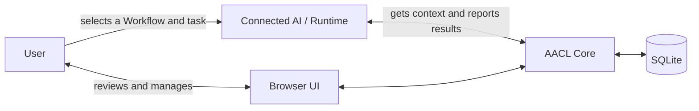
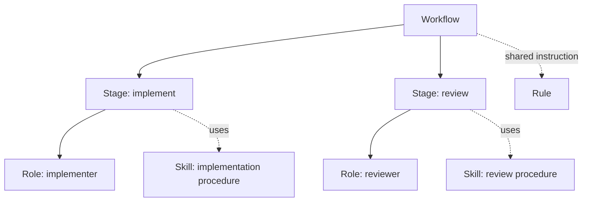
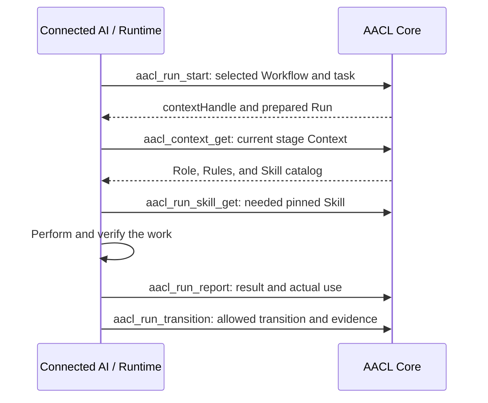
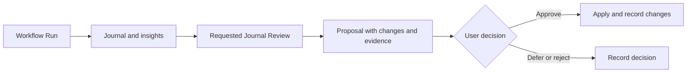

# Agent Asset Control Layer (AACL)

[English](README.md) | [日本語](README.ja.md)

AACL is a local application for organizing reusable AI development methods, running them through connected AI clients, and improving them from work records. It stores canonical assets and execution state in SQLite, exposes the same operations through a browser UI and MCP over HTTP, and provides a CLI for setup and maintenance.

The user selects and starts a Workflow for a task. AACL supplies the assigned instructions and records reported progress; the connected AI Runtime performs the actual development work and tool calls.



## Interfaces and environment

| Interface | What it does |
| --- | --- |
| Browser UI | Manage assets, start and inspect Workflow Runs, review Journals, proposals, history, and diagnostics. The current UI labels are Japanese. |
| HTTP MCP | Lets connected AI clients read and update AACL state through the MCP endpoint at `/mcp`. |
| CLI | Installs and starts the local service, registers Projects, connects clients, and performs maintenance. |

The app is for local, single-user operation. It listens on `127.0.0.1`; the default port is `4318`. The supported environment is WSL with Node.js 24 and a JavaScript-enabled Chromium-based browser.

## Install and start

From this repository, install dependencies, build the app, and run its setup command:

```bash
npm ci
npm run build
node dist/src/cli.js setup
```

The default managed directory is `$XDG_DATA_HOME/aacl`, or `~/.local/share/aacl` when `XDG_DATA_HOME` is unset. Add its `bin` directory to `PATH`, then check the service and open the UI:

```bash
export PATH="$HOME/.local/share/aacl/bin:$PATH"
aacl health
```

Open [http://127.0.0.1:4318](http://127.0.0.1:4318). Run `aacl connect` to print MCP registration commands for Codex and Claude Code. The command prints the setup steps; run the command for the client you use. Its endpoint is `http://127.0.0.1:4318/mcp`.

`setup` also installs the editable `journal` and `journal-review` Skill assets. To manage a project, run `aacl init` from its root. It registers that Project and prepares Project-scoped Runtime targets.

On WSL, `setup` also registers a Windows logon task that starts the matching WSL distribution and AACL service. Runtime entries contain only the MCP operation and Asset ID. Use `aacl autostart enable`, `aacl autostart disable`, and `aacl autostart status` to manage the task.

Common CLI commands:

| Command | Purpose |
| --- | --- |
| `aacl ensure` | Start the service if it is not running. |
| `aacl autostart <action>` | Use `enable`, `disable`, or `status` to manage Windows logon startup for the WSL service. |
| `aacl connect` | Ensure the service is running and print MCP client setup commands. |
| `aacl init` | Register the current directory as a Project. |
| `aacl diagnostics` | Show reference, Run state, and delivered Context diagnostics. |
| `aacl export DIRECTORY` | Export Markdown files and `records.json` to a new directory. |
| `aacl backup FILE` | Create a consistent SQLite backup at a new file path. |
| `aacl restore FILE --dir NEW_DIRECTORY` | Restore a compatible backup into a new managed directory. |

See the [setup and operating guide](docs/setup.md) (Japanese) for complete installation, connection, use, and recovery instructions.

## Register Projects and organize scope

Run `aacl init` in the project root you want AACL to recognize. Project identity and its root are registered in the Core. The operation copies Global bindings into the new Project scope and registers that Project's Claude Code and Codex Runtime targets. Running `aacl init` again for an already registered root returns the existing Project.

Assets can be managed globally or for a specific Project. Project Common stores the selected Rules for that Project. Runtime targets are registered for a scope, so a Global target receives Global entries and a Project target receives entries for its Project scope.

## Assets and relationships

An Asset holds reusable instructions or knowledge. Each Asset has an ID, kind, revision, and Global or Project scope. Bindings explicitly connect Assets and Workflow stages.

| Kind | Purpose |
| --- | --- |
| Workflow | Defines stages, allowed transitions, assigned Roles, and completion conditions. |
| Role | Defines the responsibility and expected output for a Workflow stage. |
| Skill | Holds reusable procedures or knowledge, with optional supporting files. |
| Rule | Holds instructions shared by the Assets or stages to which it is bound. |

Each Workflow stage has one assigned Role. Skills and Rules are bound where they are needed. A Skill can also be enabled for direct Runtime invocation. Asset kind and scope are fixed when it is created; to change either, create an Asset with the desired values and update its relationships.



## Move existing instructions into AACL

The current application supports registering and organizing Assets in the UI or through MCP. It does not provide a folder-wide import wizard. During migration, compare same-named instructions by their actual responsibilities and procedures, classify each as a Workflow, Role, Skill, or Rule, and recreate only relationships present in the source method. Keep the originals until the registered Assets and generated Runtime entries have been checked.

The [migration guide](docs/skill-migration.md) (Japanese) covers classification, registration, Runtime entries, and post-migration checks.

## Generate Runtime entries

Register a Claude Code or Codex Runtime target for the Global or Project scope where its Assets belong. AACL generates entries for Workflows and Skills enabled for direct invocation:

| Runtime | Generated entry |
| --- | --- |
| Claude Code | `<target>/commands/<slug>.md` |
| Codex | `<target>/skills/<slug>/SKILL.md` |

The entry refers to the canonical Asset by ID and retrieves its instructions from AACL. The body stays in SQLite. On Windows targets, the generated entry invokes AACL through `wsl.exe`. If a managed entry has been changed after generation, synchronization records a diagnostic instead of replacing that content. Unregistering a Runtime target leaves its generated entries in place.

## Start a Workflow in the browser UI

1. Select a Workflow in the Asset Library and choose **Run**.
2. Enter the task instruction and any Project or Runtime details, then start the Run.
3. In the prepared Run view, copy the request for the connected AI and send it to that client.
4. Inspect reported progress, delivered Context, results, and the next allowed transition in the Run view.

Starting a Run creates its prepared state and Snapshot in AACL. It does not launch an AI automatically. The connected Runtime performs the work and reports its start and results back to AACL.

## Use a Workflow through MCP

After connecting a client, read the AACL bootstrap instructions and use the registered Asset IDs. For example, `aacl_usecase_search` finds Workflows and directly invocable Skills. Starting a Workflow requires an explicit selection:

```json
{
  "workflowId": "registered-workflow-id",
  "instruction": "Fix the login failure",
  "runtime": "codex"
}
```

Pass these fields to `aacl_run_start`. If the Run should use a Project, include its `projectId`. The response contains a `contextHandle`; pass that same handle to later operations for this Run.



Read the MCP tool definitions for each operation's current input schema. The Run view and `aacl_run_get` expose its current state and allowed transitions. A Skill started directly uses `aacl_skill_get` and does not create a Workflow Run.

## Context and on-demand Skills

At Run start, AACL pins the selected Workflow, relevant Assets, bindings, and Project Common settings in an immutable Snapshot. The initial Context includes the current stage, its Role, applicable Rule bodies, and candidate Skill descriptions. Skill bodies and supporting files are retrieved from the Snapshot's pinned revisions when needed.

Context delivery and reported Skill use are stored separately. Retrieving a Skill for inspection does not by itself report that the AI used it. The execution view shows the current stage's Context and Skill candidates; Diagnostics reports the delivered Context size in UTF-8 bytes.

## Journals and improvement proposals

A Journal records observations from a task or Run. It preserves the original Markdown and parsed insights, and can be linked to a Run or recorded as a standalone task. Use the Journal Skill to record a useful result, difficulty, or improvement idea.

Journal Review examines pending insights with related Run Snapshots, History, and Provenance. It starts only when requested and does not create a separate Workflow Run. A review can save concrete proposals that identify changes, reasons, supporting Journals, affected Assets or Projects, and insights to process.

The user decides whether to approve, defer, or reject a proposal. An approved proposal can apply its Asset, binding, and Project setting changes together; the decision and applied Change Set are recorded. Deferred insights remain pending.



## Revisions, history, and diagnostics

Asset edits create revisions. Snapshots, delivery records, events, Journals, and Provenance preserve what happened at the time. Restoring an earlier Asset revision creates a new revision. Deleting an Asset removes it from normal use while preserving its history. Change Sets can also be restored to their recorded prior state.

The History view compares Asset revisions and shows reasons and Provenance. Diagnostics checks issues such as unresolved relationships, repeated transitions, Runtime-entry failures, and delivered Context size. These records describe operations and reported use; they do not measure the quality of the AI's work.

## Export and backup

| Command or UI action | Result |
| --- | --- |
| `aacl export DIRECTORY` | Writes one Markdown file per Asset and Journal, plus `records.json` with record and revision data. The destination must be a new directory. |
| `aacl backup FILE` | Creates a consistent SQLite backup. The destination must be a new file. |
| `aacl restore FILE --dir NEW_DIRECTORY` | Checks SQLite integrity and schema version 1, then restores into a new managed directory and installs the app there. |

The UI also provides export and backup actions. Markdown files are convenient for reading individual Assets and Journals; `records.json` and the SQLite backup preserve structured records and revision data for transfer or recovery.

## Development and verification

```bash
npm ci
npx playwright install chromium
npm run dev       # Development service and UI, using .local data
npm run check     # Build, Core/HTTP/CLI tests, and browser tests
```

The development UI is available at [http://127.0.0.1:4318](http://127.0.0.1:4318). Development data is stored in `.local/` in this repository. The canonical verification command is `npm run check`.

The application is implemented in TypeScript on Node.js, uses SQLite for its canonical state, and serves the browser UI and HTTP MCP endpoint from the local service.
