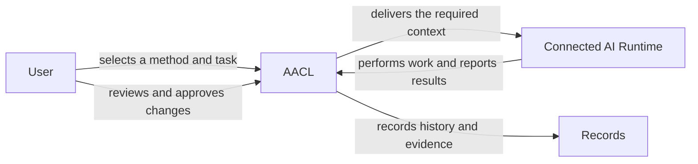
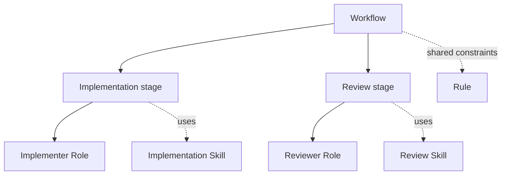
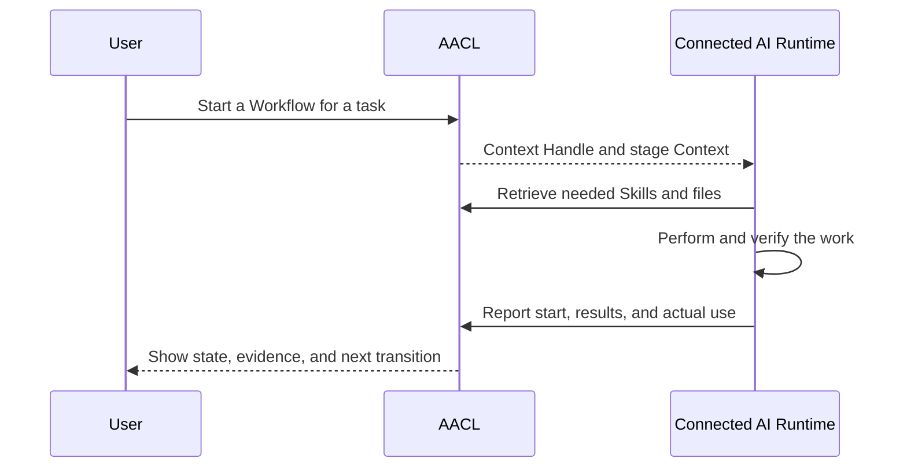
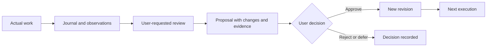

# Agent Asset Control Layer (AACL)

[English](README.md) | [日本語](README.ja.md)

AACL is a local control layer for turning AI development know-how into reusable, inspectable methods. It lets you organize instructions, run them through connected AI clients such as Claude Code and Codex, record what happened, and improve the method from those records.

The purpose of AACL is to separate method management from execution:

## What AACL is for

- Save development methods as reusable assets instead of scattering them across prompt files.
- Describe work as a Workflow with stages, responsibilities, outputs, and allowed return paths.
- Reuse Roles, Skills, Rules, Task Types, and Capabilities where they are needed.
- Start a Workflow for a concrete task and let the connected Runtime perform the actual work.
- Deliver only the Context required for the current stage, while retrieving Skill bodies and supporting files when needed.
- Keep the selected revisions, delivered Context, execution reports, and actual Skill use traceable.
- Bring existing instructions into AACL with provenance, classification, verification, and a safe restore path.
- Capture useful observations from real work and turn them into reviewable improvement proposals.
- Apply approved changes as new revisions while preserving history, snapshots, and decisions.
- Export a consistent set of assets for connected or standalone use.

## Assets express a development method

An Asset is reusable instruction or knowledge with an ID, revision, applicability conditions, and relationships to other assets.

| Asset | Purpose |
| --- | --- |
| Workflow | Defines stages, responsibilities, transitions, outputs, and completion criteria. |
| Role | Defines who is responsible for a stage and what it should produce. |
| Skill | Provides procedures, knowledge, and optional supporting files when needed. |
| Rule | Provides instructions that apply when their conditions match. |
| Task Type | Describes a work objective, quality criteria, and constraints. |
| Capability | Describes an external tool connection and permission information. |
| Other assets | Preserve project knowledge, policies, templates, and unclassified material. |

The Workflow owns delegation and stage control. A Skill provides the method used by the current actor; it does not decide who acts or which stage comes next.

## Execute with the right Context

When a Workflow starts, AACL fixes the selected asset revisions and conditions in a Snapshot. The connected Runtime receives the current stage, Role, applicable Rules, and Skill candidates. It retrieves a pinned Skill body or supporting file only when it needs one.

Context delivery and reported use are separate records: retrieving a Skill for inspection is not treated as using it. A Run is identified by its Context Handle so that later reads, reports, and transitions stay attached to the correct execution.

AACL manages the method, Context, state, and records. The Runtime performs model invocation, tool use, and development work. Starting a Run prepares the execution; it does not silently launch an AI or invent a result.

## Improve methods from real work

A Journal records a useful result, difficulty, or improvement idea from an actual task. A requested review connects those observations with the relevant Run Snapshot, history, and provenance, then produces a concrete proposal.

The user decides whether a proposal is approved, deferred, or rejected. Past Snapshots, execution records, provenance, and decisions remain available for comparison. Restoring an earlier state creates a new revision rather than rewriting history.

## Move and reuse existing instructions

AACL should make it possible to bring existing instructions into a structured method without losing their origin or damaging the source files. The import flow can:

- discover candidate instructions and supporting files;
- classify their actual responsibilities as Workflows, Roles, Skills, Rules, or other assets;
- preserve source paths, hashes, and provenance;
- verify reads, writes, and classification before switching usage over;
- keep unsupported or plugin-managed material in place; and
- restore the previous organization without overwriting later source edits.

The same assets can be exported as a connected package for use with AACL or as a standalone package that does not require the Core.

## Interfaces

The browser UI, MCP, and CLI use the same Core operations. The UI is for inspecting and managing assets, Runs, Journals, proposals, history, and diagnostics. MCP lets connected AI clients obtain Context, retrieve Skills, report execution, and request changes. The CLI supports project-oriented and operational tasks.

AACL is designed for local, single-user use. Its canonical records and immutable execution evidence are kept in the local data store.

## Setup

See [docs/setup.md](docs/setup.md) for installation, startup, Runtime connection, ports, environment settings, migration, backup, restore, and verification.
